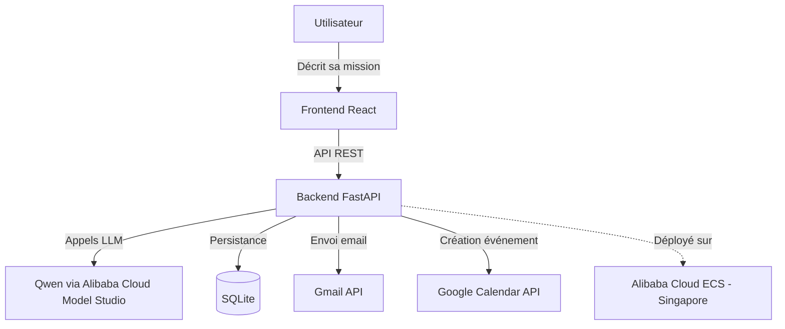
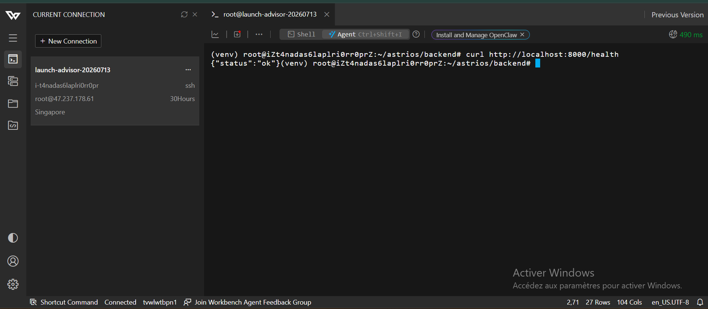

# Astrios — AI Chief of Staff

🌐 **Démo en ligne** : http://47.237.178.61

Astrios transforme un objectif exprimé en langage naturel en une **mission entièrement exécutée** : Orion (propulsé par Qwen) comprend l'intention, pose les questions nécessaires, construit un plan, génère les documents utiles, puis exécute des actions réelles (email, événement calendrier) — toujours avec l'approbation explicite de l'humain avant toute exécution.

**Track : Autopilot Agent** — Qwen Cloud Hackathon

## 🎯 Le problème

Aujourd'hui, accomplir un objectif professionnel demande de jongler entre Gmail, Calendar, Notion, Trello et une dizaine d'autres outils. Astrios centralise ce travail : un objectif, une conversation, un résultat exécuté.

## ✨ Fonctionnalités

- **Discovery intelligente** — Orion pose une question à la fois, détecte les réponses ambiguës ou hors-sujet, et s'adapte
- **Planning automatique** — génère un plan de tâches structuré à partir de la conversation
- **Génération de documents** — produit les documents pertinents pour chaque mission (types déterminés dynamiquement, aucun gabarit fixe)
- **Exécution avec approbation humaine** — propose des actions réelles (email via Gmail API, événement via Google Calendar API), toujours soumises à validation avant exécution
- **Robustesse** — retry automatique sur échec, anti-hallucination sur dates/heures, reprise après interruption

## 🏗️ Architecture



## 🛠️ Stack technique

| Couche | Technologie |
|---|---|
| Frontend | React + Vite |
| Backend | FastAPI (Python) |
| Base de données | SQLite + SQLAlchemy |
| IA | Qwen (via Alibaba Cloud Model Studio, API compatible OpenAI) |
| Intégrations | Gmail API, Google Calendar API (OAuth 2.0) |
| Déploiement | Alibaba Cloud ECS (Ubuntu, Singapore) |

## ☁️ Preuve de déploiement Alibaba Cloud

Le backend tourne en production sur une instance Alibaba Cloud ECS (région Singapore) :



## 🚀 Installation locale

### Backend
```bash
cd backend
python3 -m venv venv
source venv/bin/activate  # Windows: venv\Scripts\activate
pip install -r requirements.txt
cp .env.example .env  # puis remplir QWEN_API_KEY
uvicorn main:app --reload --port 8000
```

### Frontend
```bash
cd frontend
npm install
npm run dev
```

## 📄 Licence

Ce projet est sous licence GPL-3.0 — voir [LICENSE](LICENSE).

## 🏆 Hackathon

Ce projet a été développé dans le cadre du **Global AI Hackathon Series with Qwen Cloud**, track **Autopilot Agent**.