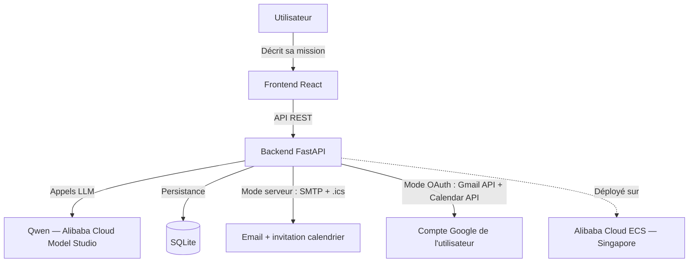

# Astrios — AI Chief of Staff

🌐 **Démo en ligne** : http://47.237.178.61 · 🏆 Qwen Cloud Hackathon — Track **Autopilot Agent**

> Un objectif exprimé en langage naturel → une mission **réellement exécutée**.

Orion, l'agent d'Astrios (propulsé par **Qwen** sur Alibaba Cloud), comprend l'intention, pose les bonnes questions, construit un plan, génère les documents utiles, puis **exécute des actions réelles** — emails et invitations calendrier — toujours avec l'approbation explicite de l'humain avant toute exécution.

## 🎯 Le problème

Accomplir un objectif professionnel demande de jongler entre email, calendrier, documents et outils de gestion. Chaque outil fait une partie du travail ; personne n'orchestre l'ensemble. Astrios centralise : **un objectif, une conversation, un résultat exécuté.**

## 🧭 La vision

Astrios vise à devenir un véritable **Chief of Staff numérique** : un agent qui raisonne comme un professionnel du domaine de chaque mission, anticipe les besoins, coordonne les communications et pilote l'exécution de bout en bout — l'humain fixe le cap et garde le contrôle des décisions, l'agent fait le travail. Ce hackathon en pose les fondations : la boucle complète intention → plan → livrables → exécution réelle, avec approbation humaine systématique.

## ✨ Ce qu'Astrios fait aujourd'hui (fonctionnel et testable)

- **Découverte intelligente** — une question à la fois, détection des réponses ambiguës ou hors-sujet, distinction complément/remplacement quand la demande évolue
- **Plan de tâches structuré** généré depuis la conversation
- **Documents pertinents** produits dynamiquement selon la mission (aucun gabarit fixe)
- **Actions réelles avec approbation humaine** :
  - Emails envoyés réellement (voir modes d'exécution ci-dessous)
  - Invitations calendrier : email combiné avec pièce jointe **.ics (METHOD:REQUEST)** — bandeau natif Gmail « Oui / Non / Peut-être » chez le destinataire — + bouton « Ajouter à Google Calendar »
  - Règle stricte de composition : **chaque destinataire reçoit exactement ce qui le concerne**, ni plus ni moins
- **Réouverture de mission** — une mission terminée peut être relancée ; les nouvelles demandes s'ajoutent sans jamais rejouer les actions déjà exécutées (idempotence)
- **Fiabilité** — gestion des fuseaux horaires (IANA), jour de la semaine calculé côté serveur (anti-hallucination), retry sur échec, exécution idempotente, erreurs remontées à l'utilisateur

## 🔀 Deux modes d'exécution

| Mode | Quand | Expéditeur / Organisateur |
|---|---|---|
| **Serveur (par défaut)** | Aucune connexion Google requise — c'est le mode de la démo publique | Compte dédié Orion (SMTP) |
| **OAuth Google** | L'utilisateur connecte son compte (app en mode test : comptes approuvés uniquement) | Le compte de l'utilisateur, événement créé directement dans son agenda |

Dans les deux modes, l'expéditeur du mail et l'organisateur de l'invitation sont **toujours cohérents**.

## 🧪 Tester en 3 minutes (guide examinateur)

1. Ouvrir **http://47.237.178.61** → « Nouvelle mission »
2. Écrire par exemple : *« envoie un mail à [votre adresse] pour une réunion demain 15h et programme-la dans mon agenda »*
3. Répondre aux questions d'Orion (objet, durée, signature…)
4. Observer : plan généré → documents → actions proposées dans le panneau de droite
5. Cliquer **« Approuver et exécuter tout »**
6. Vérifier votre boîte mail : le message contient l'invitation avec le **bandeau natif Gmail** (Oui/Non/Peut-être), le bouton « Ajouter à Google Calendar », à la bonne date et la bonne heure
7. Renvoyer un message dans la même mission (ex. une modification) : la mission se rouvre, les actions déjà exécutées ne sont jamais rejouées

## 🏗️ Architecture



## 🛠️ Stack technique

| Couche | Technologie |
|---|---|
| Frontend | React + Vite |
| Backend | FastAPI (Python) |
| Base de données | SQLite + SQLAlchemy |
| IA | **Qwen** via Alibaba Cloud Model Studio (API compatible OpenAI) |
| Envois | SMTP + iCalendar (.ics), Gmail API & Google Calendar API (OAuth 2.0) |
| Déploiement | **Alibaba Cloud ECS** (Ubuntu, Singapore) + Nginx |

## ☁️ Preuve de déploiement Alibaba Cloud

Backend et frontend en production sur une instance **Alibaba Cloud ECS** (région Singapore), l'IA servie par **Qwen via Model Studio** :


Fichiers démontrant l'usage des services Alibaba Cloud : [`backend/orion.py`](backend/orion.py) (appels Qwen via l'endpoint Model Studio).

## 🚀 Installation locale

### Backend
```bash
cd backend
python3 -m venv venv
source venv/bin/activate  # Windows : venv\Scripts\activate
pip install -r requirements.txt
cp .env.example .env      # puis remplir QWEN_API_KEY (et le bloc SMTP pour l'exécution réelle)
uvicorn main:app --reload --port 8000
```

### Frontend
```bash
cd frontend
npm install
npm run dev
```

## 📄 Licence

Projet sous licence **GPL-3.0** — voir [LICENSE](LICENSE).

## 🏆 Hackathon

Développé en solo dans le cadre du **Global AI Hackathon Series with Qwen Cloud**, track **Autopilot Agent**.